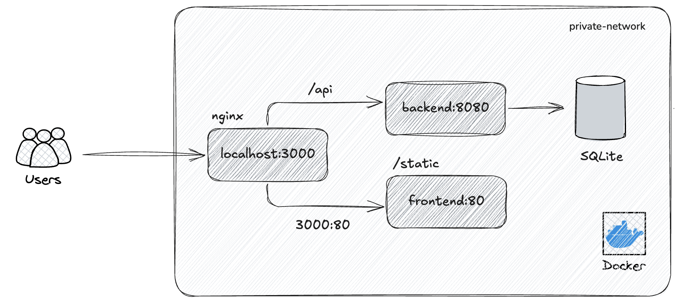

# bookcabin

## Directory

All documents check at this:

- [backend](/backend/README.md)
- [frontend](./frontend/README.md)

## Getting Started

How to start this project in parallel.

```shell
# ensure docker and docker compose installed in your local.
docker compose up -d
```

## Architecture Overview


