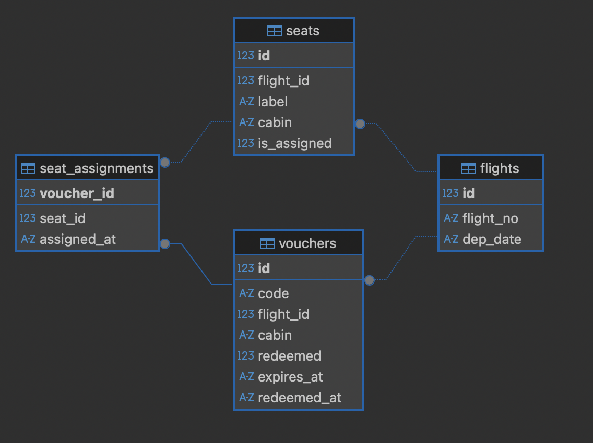

# backend

Backend service to serve REST APIs submit voucher seat assignments for airline campaign.

## Tech Stack

- Go Fiber (HTTP Server)
- SQLite (database)
- Cobra (CLI)

## Features

- Submit voucher assignments endpoints.
- Create a new flights, seats, and vouchers.
- List of all flights, seats, and vouchers.

## Architecture Overview


## Architecture Patterns

- Presentation Layer (delivery/http/)
  - HTTP handlers
  - DTOs for request/response
  - Routes configuration
- Business Layer (internal/controller/)
  - Business logic orchestration
  - Use case implementations
- Data Layer (internal/repository/)
  - Database access
  - SQL queries with transactions
- Domain Models (internal/models/)
  - Core business entities

## Sequence Diagram Voucher Assignments


## DB Diagram



## Directories

```
cmd
config
delivery/
└── http/
    ├── dto
    ├── handler
    ├── middlewares
    └── routes.go
internal/
├── controller
├── models
└── repository
main.go
```

- cmd is entry point for commands management
- delivery is a presentation layers, can be use for http, CLI and etc.
- internal modules to manage controller, models and repository

## Pre-Requisites

- [Go](https://go.dev/doc/install)
- SQLite

## Getting Started

```shell
cp .env.example .env
go run .
```

## Configuration

```
PORT=8080
DB_PATH=./bookcabin.db
```

## Endpoints

Create a new flights, to view just change the verb from `POST` to `GET`.

```shell
curl --location 'http://localhost:8080/api/v1/flights' \
--header 'Content-Type: application/json' \
--data '{
    "flight_numbers": ["GA33", "GA221"],
    "dep_date": "2025-10-04"
}'
```

Create a new seats, to view just change the verb from `POST` to `GET`.

```shell
curl --location 'http://localhost:8080/api/v1/seats' \
--header 'Content-Type: application/json' \
--data '{
 "flight_id": 23,
 "cabin": "BUSINESS",
 "labels": ["1A", "1B", "1C"]   
}'
```

Create a new vouchers, to view just change the verb from `POST` to `GET`.

```shell
curl --location 'http://localhost:8080/api/v1/vouchers' \
--header 'Content-Type: application/json' \
--data '{
    "code": "V2025X2",
    "flight_id": 23,
    "cabin": "ECONOMY"
}'
```

Submit an assignments

```shell
curl --location 'http://localhost:8080/api/v1/vouchers/assigns' \
--header 'Content-Type: application/json' \
--data '{
    "voucher_code": "V2025X2"
}'
```
